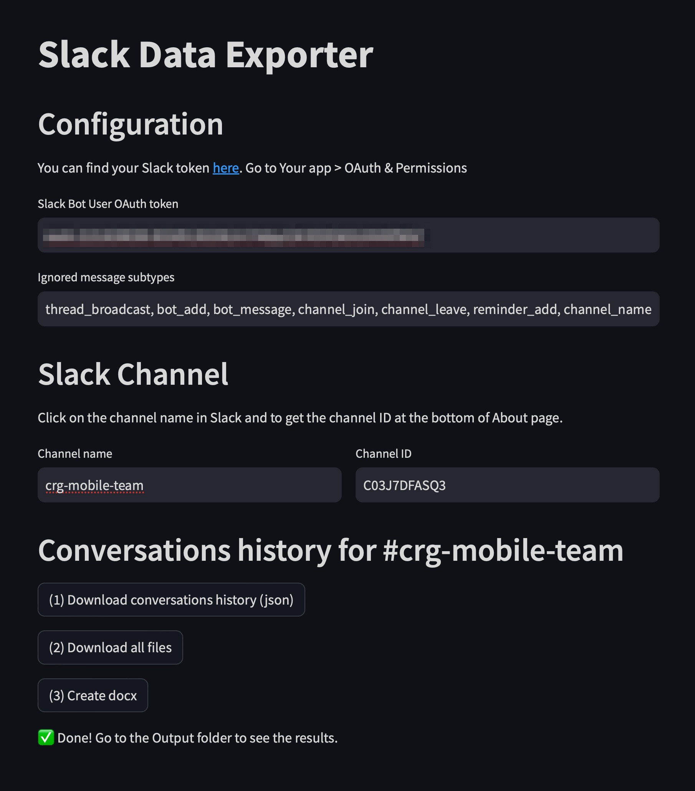
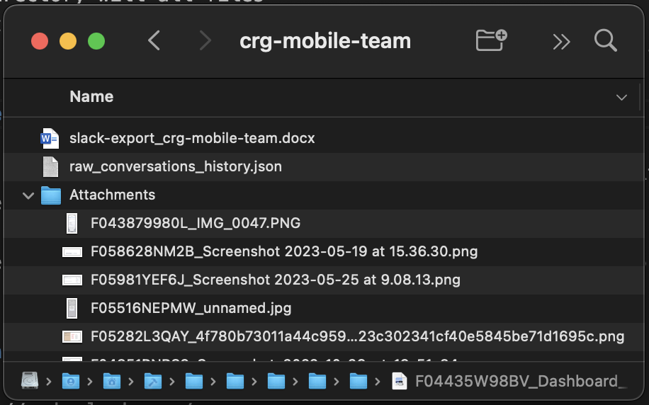
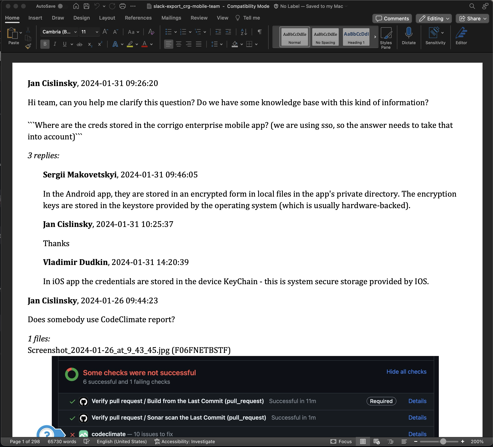

# Slack Data Export

An application to export the history of Slack channel conversations, including all associated files.

**It works for all channels** where your app is invited <u>**including private**</u> ones (see Prerequisities).

## The app output

The app downloads and stores all conversations from a selected Slack channel including all files. When done, you can find these results in the Output folder:
- Attachmets directory will all files
- raw_conversation_history.json (all conversations in raw format)
- slack-export.docx (pretty printed conversations with inlined image files)

## Prerequisites

As information included in various channels can be highly sensitive it's recommended not to share one Slack app to access all channels, rather create a Slack app per team.

When you create your own app you have under control who has access to it (and all Slack channels' conversations where the app was added).

### How to create Slack app

1. Go to https://api.slack.com/apps
2. Create New App
3. Go to OAuth & Permissions
4. Add these scopes to Bot Token Scopes
   1. channels:history
   2. groups:history
   3. im:history
   4. mpim:history
   5. users:read
   6. files:read
5. Scroll up to OAuth Tokens for Your Workspace and "Request to Install"
6. Submit your request
7. Wait for the approval (you will be notified directly in Slack)
8. Once approved, go to the App page again and install it into the workspace

## How to run the app

The app uses Streamlit library. At first, you need to install all the required tooling, then you can just start the app.

### Install tooling

1. Install Homebrew, in Terminal: `/bin/bash -c "$(curl -fsSL https://raw.githubusercontent.com/Homebrew/install/master/install.sh)"`
1. Install Python, in Terminal: `brew install python`
1. Update path, in Terminal (zsh): `(echo; echo 'eval "$(/usr/local/bin/brew shellenv)"') >> /Users/corrigomobile/.zprofile`
1. Install dependencies, in Terminal: `pip3 install streamlit python-docx` (maybe you will need to update pip `/Library/Developer/CommandLineTools/usr/bin/python3 -m pip install --upgrade pip`)
1. Now you can start the app

### Run the app

1. Open Terminal in the repository tool directory
2. Run `streamlit run main.py`
3. The browser will be opened with address "localhost:8501"
